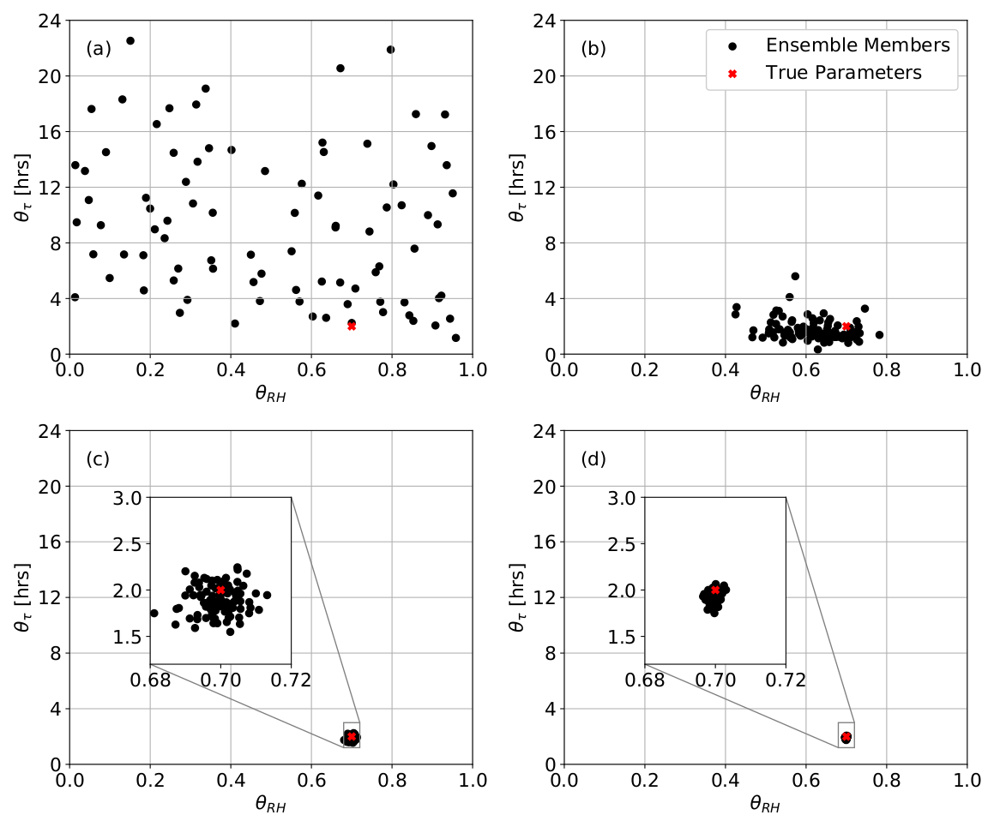
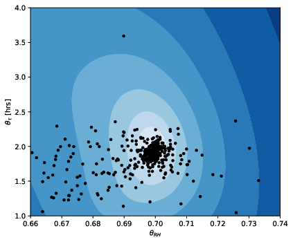
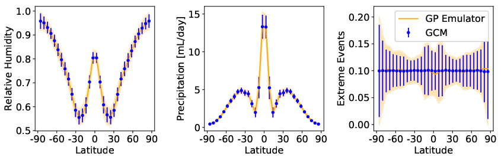
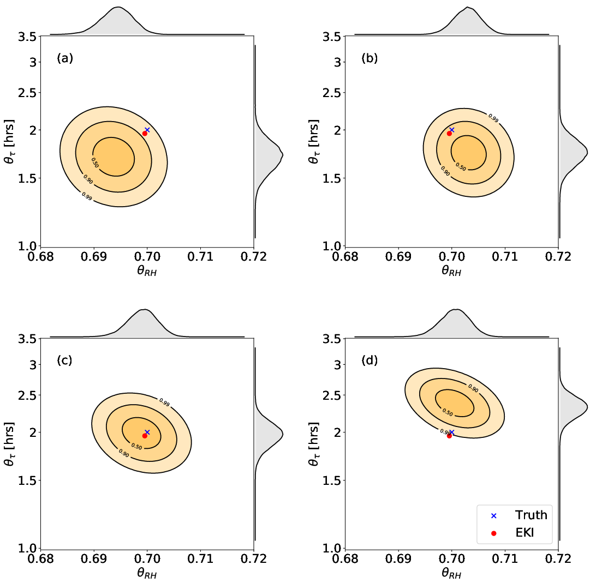

# Uncertainty Quantification of Climate Models

This is an example of some work I did as a graduate student, testing a
sequence of algorithms for calibration and uncertainty quantification
of climate models.

It's safe to assume the code included will not work as is. Important
excerpts are included as examples. Code in the directories is a bit
redundant, but that was just done for organizational purposes.

## The Model

The climate model tested was the Betts-Miller model, a simple
precipitation model, applied to a [General Circulation
Model](https://github.com/tapios/fms-idealized) (GCM) of the
atmosphere. Simulations model the planet as an aquaplanet (no land
mass), with a perpetual equinox (12 hrs night and day).

The Betts-Miller model specifically closes source terms for
precipitation and heat release from condensation in the moisture and
energy conservation equations. These models are simple relaxation
schemes,

$$
\begin{align}
Q_q &= \frac{q - q_\mathrm{ref}}{\tau}\\
Q_T &= \frac{T - T_\mathrm{ref}}{\tau},
\end{align}
$$

where $T$ is temperature and $q$ is the specific humidity. Since
thermodynamics equations can relate reference humidities and
temperatures, we can model them with just one parameter, which we
interpret as a reference value for relative humidity. Along with the
timescale parameter, we have two model parameters which will be
referred to as the vector $\theta$.

## The Bayesian Approach to Inverse Problems

Equations solved in a GCM are a nonlinear, chaotic system of
equations. Inverting this system of equations if difficult, if not
impossible. Hence, we turn to a Bayesian approach to solving inverse
problems, where we instead sample from a posterior distribution of
model parameters $\theta$ given some set of data $y$.

For this approach, we model data as

$$
\begin{align}
y = \mathcal{G}(\theta) + \eta,
\end{align}
$$

where $\mathcal{G}$ is the model response of the GCM (postprocessed as
needed) and $\eta$ is a sample of noise, $\eta \sim \mathcal{N}(0,
\Gamma)$. Simply put, we decompose data into a smooth, deterministic
model response plus noise.

From Bayes' law, we have

$$
\begin{align*}
\rho(\theta | y) \propto \rho(y | \theta) \rho(\theta) \propto \exp\left(\frac{1}{2}\lVert\mathcal{G}(\theta) - y\rVert_{\Gamma}\right) \rho(\theta),
\end{align*}
$$

which breaks down the posterior distribution into a product of the
likelihood and a prior. MCMC algorithms, for example, sample from this
posterior and will model this distribution of parameters given some
data. The mode of this distribution can be interpreted as best fit
parameter estimates, while the spread of the distribution quantifies
uncertainty in the parameters due to model noise and/or data
measurement errors.

## The Calibrate, Emulate, Sample (CES) Algorithm

We face several challenges with Bayesian inverse problem when applied
to chaotic models. For starters, MCMC algorithms assume the model
response deterministic (no noise). As GCM are chaotic, we could assume
ergodicity,

$$
\begin{align}
\mathcal{G}(\theta) = \lim_{T\rightarrow\infty} \int_0^T \mathcal{G}(\theta; z(t)) dt,
\end{align}
$$

where $z(t)$ is the state of the system. However, this is not
practical as it can be very computational expensive to generate and
average enough to data to filter out enough noise to be suitable for
MCMC sampling.

Additionally, MCMC sampling requires some prior knowledge of the
parameter space to run efficiently. We want to start chains near a
(presumably global) minimum of the objective to minimize
burnin. Exploring the parameter space would require optimization
algorithms, but common gradiant-based algorithms are not trustworthy
with chaotic models.

These challenges led to the Calibrate, Emulate, Sample (CES)
algorithm. This algorithm consists of three steps:

1) Explore the parameter space using Ensemble Kalman Inversion (EKI).

2) Train a statistical emulator using Gaussian Processes, reusing
model evaluations from the previous step as training points.

3) Use the emulator for MCMC sampling in lieu of the full model.

This algorithm addresses our issues in the following ways. The EKI
algorithm is a derivative-free optimization algorithm and should be
applicable to chaotic models such as GCM. Furthermore, it requires
little prior knowledge of the parameter space. Over iterations of the
EKI algorithm, the parameter ensemble collapses, yielding a dense set
of model evaluations near the (presumably global) minimum which can be
reused to train an emulator. Gaussian processes yield smooth,
deterministic statical moments of the model which are safe to use in
MCMC sampling algorithms.

### Calibrate -- Ensemble Kalman Inversion

The calibration step uses the EKI algorithm to explore the parameter
space, finding the optimal parameters for our model to recover data,
while simultaneously generating training points for the emulation
step. For this experiment, training data was generating using the
model itself with additional noise added to mimic measurement
error. Data was extracted and postprocessed to yield relative
humidity, precipitation rates, and the probability of extreme
precipitation events, all of which have a strong dependence on the
model parameters. These were taken at a fixed altitude and averaged
across latitudes to reduce the dimensionality of the data to roughly
100 points. See [this code](0_true_data/generate_true_data.py) for an
example of what this entails.

The EKI algorithm requires an initial ensemble of model parameters. It
is recommended that this ensemble spans a large part of the parameter
space to ensure it contains the global minimum of the objective. We
used the following to generate our initial ensemble parameters:

$$
\begin{align}
\theta_{RH} &\sim U(0, 1)\\
\theta_{\tau} &\sim LN(12, 12^2)
\end{align}
$$

The uniform distribution suits our relative humidity parameter as its
values are bound between 0 and 1. The log normal distribution suits
our timescale parameter since timescales must be positive, with a mean
and standard deviation of 12 hrs to represent half a day.

   

Here are links to code [implementing](1_calibrate/eki.py) and
[running](1_calibrate/main.py) the EKI algorithm.  This image shows
iterations 0, 1, 5 and 10 of the EKI algorithm with an ensemble size
of 100. We see that the ensemble collapses very quickly, and
ultimately collapses to have an ensemble mean very close to the true
parameters used to generate measurement data. It is important to
understand that the covariance of this collapsed ensemble has no
statistical meaning in the context of the Bayesian inverse problem. It
can be used as a convergence criterion, and nothing more.

### Emulate -- Gaussian Processes

After running the EKI algorithm, we have a set of points for training
the emulator. The emulator was trained with ensembles from the first 5
iterations of EKI (500 evaluations total) using the RBF kernel with
the sparse model to reduce the size of the emulator. The script used
to train the emulator can be found [here](2_emulate/run_gp.py).

   

The plot shows the training points over the objective minimized in
EKI. We see that the training points are very dense near the minimum
of the objective, but there are nearby regions where the training
points are very sparse. To validate the emulator, we plotted 95\%
confidence itervals of the true data and of the emulator evaluated at
true paremeters. We see that the emulator aligns very well with the
true data.

   

### Sample -- MCMC Sampling

With an emulator trained, we can now run the MCMC algorith to get
samples from the posterior distribution. To do this, we used the
Metropolis algorithm and collected 100,000 samples. This was run on
300 samples of noisy measurement data generated by the full model. The
script running MCMC sample with the statistical emulator can be found
[here](3_sample/run_mcmc_model_w_gp.py).

   

The plot shows posterior samples from 4 of the 300 runs. While we see
some variation in the posteriors, their uncertainty is small, less
than 2\% for the humidity parameter and less than 60 minutes for the
timescale parameter. Additionally, the true parameters used to
generate measurement data are well contained within these posteriors.

## Conclusions

This work was centered around testing a set of algorithms for
optimization and uncertainty quantification on a nonlinear, chaotic
model, and yielded very promising results.

## References

[A. K. Betts. A new convective adjustment scheme. Part I: Observational and theoretical basis. Quarterly Journal of the Royal Meteorological Society. 112(473), 1986](https://rmets.onlinelibrary.wiley.com/doi/abs/10.1002/qj.49711247307)

[E. Cleary, A. Garbuno-Inigo, S. Lan, T. Schneider, A. M. Stuart. Calibrate, emulate, sample. Journal of Computational Physics. 424, 2021](https://www.sciencedirect.com/science/article/abs/pii/S0021999120304903)

[M. A. Iglesias, K. J. Law, and A. M. Stuart. Ensemble Kalman methods
for inverse problems. Inverse Problems, 29(4):045001, 2013. 2, 4, 7](https://iopscience.iop.org/article/10.1088/0266-5611/29/4/045001/meta)

[P. A. O'Gorman and T. Schneider. The Hydrological Cycle over a Wide Range of Climates Simulated with an Idealized GCM. The Journal of Climate. 21(15), 2008](https://journals.ametsoc.org/view/journals/clim/21/15/2007jcli2065.1.xml)
